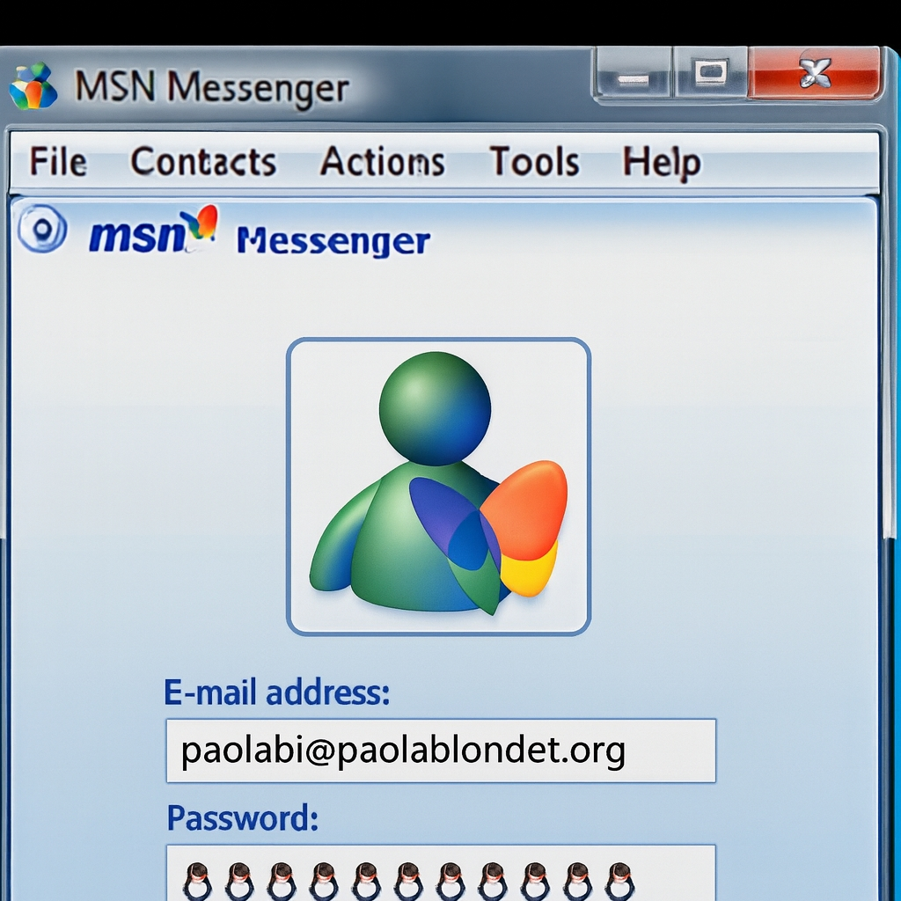

## Disclaimer: iGNUranza is a neologism
Because I can see that GNU is like a Religion 😊

## If you don't have sense of humor you better don't read my website. 🤷‍♀️

<!-- Immagine ridimensionata -->

  
  

    ✨ La Regina della Pigrizia ✨
  

<h2> 🪔🕯️📜✨ Biography of Trovatella (Foundling) (Paola Blondet) ✒️📜</h2>

  <a href="photo_mio.pdf" target="_blank" 
     style="display: inline-block; padding: 10px 15px; background-color: #4A90E2; color: white; text-decoration: none; border-radius: 5px; font-weight: bold; transition: background-color 0.3s ease;"
     onmouseover="this.style.backgroundColor='#357ABD'" 
     onmouseout="this.style.backgroundColor='#4A90E2'">
    📜 
  </a>

🔵🐧🔵🐧🔵🐧🔵🐧🔵🐧🔵🐧🔵🐧🔵🐧🔵🐧

**Benvenuti nel mio mondo poliglotta 💫**

🔵🐧🔵🐧🔵🐧🔵🐧🔵🐧🔵🐧🔵🐧🔵🐧🔵🐧

  <!-- Tasto audio principale -->
  <button class="btn-audio"
          onclick="document.getElementById('mutlak-seveceksin-benim').play()">
    🎧 Mutlak Seveceksin Benim
  </button>

  <!-- Controlli -->
  

    <button class="btn-play"
            onclick="document.getElementById('mutlak-seveceksin-benim').play()">▶️ Play</button>

    <button class="btn-pause"
            onclick="document.getElementById('mutlak-seveceksin-benim').pause()">⏸ Pause</button>

    <button class="btn-stop"
            onclick="var a=document.getElementById('mutlak-seveceksin-benim'); a.pause(); a.currentTime=0;">⏹ Stop</button>

    <button class="btn-rewind"
            onclick="document.getElementById('mutlak-seveceksin-benim').currentTime=0;">⏮ Rewind</button>
  

  <!-- Audio -->
  <audio id="mutlak-seveceksin-benim"
         src="/mutlak-seveceksin-benim.mp3"
         preload="auto"></audio>

 

💠🔶💠🔶💠🔶💠🔶💠🔶💠🔶💠🔶💠🔶💠🔶💠

## ✨ Origini 🧐
"Trovatella" è il nome pensato per GitHub che porto qui con ironia:  
come gli animali 🐾 trovati per strada, anch’io sono stata raccolta  
nelle strade del codice ⛓️‍💥🔗 e del Web, principiante tra crash e popup.✴️👣

## Biografia Accademica 📓✒️🎓

Laureata in Linguistica Applicata con laurea Specialistica in Letterature Europee e Anglo-Americane presso l’Università di Pavia, dove ho conseguito 30 e Lode nell'esame di Storia del Cristianesimo portando come tema l’Apocalisse, ho studiato anche XML come Markup e scoperto i primi Parser che Google avrebbe poi implementato e le banche dati BNC. 
Appassionata di lingue e linguaggi da sempre, amo creare e reinventare con creatività e ironia, trasformando testi e simboli in nuove visioni digitali.

---

## ✨ La Scoperta di GitHub 
Ho iniziato senza sapere nulla, ma ogni comando imparato  
è stato un passo verso la libertà digitale.  
Il Kernel è diventato la mia casa, GitHub Pages il mio diario.

---

## ✨ Identità
Essere "Trovatella" significa accettare di essere nuova,  
lasciarsi trovare dal sapere,  
e trasformare l'ignoranza in curiosità.

---

## ✨ Missione
Raccontare il Web con poesia e ironia,  
portare leggerezza nel mondo del codice,  
e dimostrare che anche chi si sente “trovatella”  
può diventare parte della comunità digitale.

---

## 🌐 Benedizione
> “Gloria al Kernel che accoglie i principianti.  
> Che i commit siano sinceri,  
> e che i link non muoiano mai.”

  
*Rielaborazione grafica ispirata alla schermata di MSN Messenger — memoria visiva del Villaggio digitale.*

## 🔗 Homepage del mio Atlante

Benvenuti nel mio Atlante digitale: pensieri, memorie e ribaltamenti dal Villaggio MSN.  
Ogni modulo è scritto in Markdown, firmato e archiviato come nodo di risonanza.  
👉 [Vai alla homepage del mio Atlante](https://trovatella.github.io/-Memorie-dal-Villaggio-MSN/)

---

## 🔗 Homepage of my Atlante

Welcome to my digital Atlante: thoughts, memories, and ribaltamenti from the MSN Village.  
Each module is written in Markdown, signed, and archived as a node of resonance.  
👉 [Go to the homepage of my Atlante](https://trovatella.github.io/-Memorie-dal-Villaggio-MSN/)

---

## 🔗 Page d’accueil de mon Atlante

Bienvenue dans mon Atlante numérique : pensées, souvenirs et renversements du Village MSN.  
Chaque module est rédigé en Markdown, signé et archivé comme nœud de résonance.  
👉 [Accéder à la page d’accueil de mon Atlante](https://trovatella.github.io/-Memorie-dal-Villaggio-MSN/)

---

## 🔗 Atlante Ana Sayfası

MSN Köyü’nden düşünceler, anılar ve tersyüz edişlerle dolu dijital Atlante’me hoş geldiniz.  
Her modül Markdown ile yazılmış, imzalanmış ve yankı düğümü olarak arşivlenmiştir.  
👉 [Atlante ana sayfasına git](https://trovatella.github.io/-Memorie-dal-Villaggio-MSN/)

## Paola Blondet

### 👩‍💻 Über mich
Absolventin der Sprachwissenschaften mit TFA/TFU-Nachweisen, leidenschaftlich für digitale Hygiene und operative Strategien.  
Ich verwandle jede technische Episode (robots.txt, Sitemap, Meta-Tags, semantische Anreicherung) in Module der Klarheit und Archivierung.  

### 🌐 Interessen
- Digitale Hygiene und Web-Indizierung  
- Markdown und semantische Archivierung  
- Digitale Atlanten und kulturelle Genealogien  
- Mehrsprachigkeit (IT, EN, FR, TR, DE)  

### 🛠 Fähigkeiten
- Konfiguration und Validierung von robots.txt und Sitemaps  
- Semantische Optimierung für Bing, DuckDuckGo, Ecosia  
- Zweisprachige Archivierung und visuelle Siegel  
- GitHub Pages als operatives Atlas  

### 📚 Beiträge
Ich beantworte Fragen auf Stack Exchange mit einem klaren und operativen Ansatz und biete dokumentierte und reproduzierbare Lösungen.  
Jede Antwort ist ein Resonanzknoten, signiert und archiviert.  

### 🔗 Atlante
[Homepage meines Atlante](https://trovatella.github.io/-Memorie-dal-Villaggio-MSN/)
