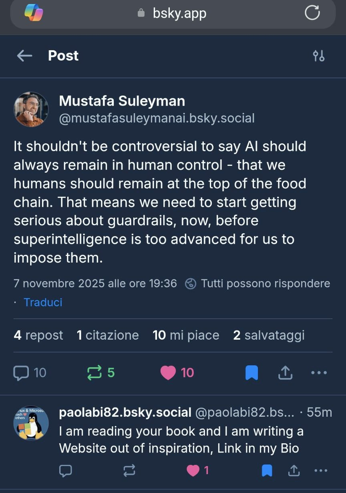

<a href="https://u24.gov.ua/" target="_blank" rel="noopener"
   title="Vai a United24 per sostenere l’Ucraina">
  

    

      

      

    

  

</a>

## If you need to stop the music
Just refresh the page ♻️

𝕴 𝖘𝖔𝖑𝖊𝖒𝖓𝖑𝖞 𝖉𝖊𝖉𝖎𝖈𝖆𝖙𝖊 𝖙𝖍𝖎𝖘 𝖏𝖔𝖇 𝖙𝖔 𝖘𝖔𝖒𝖊 𝖘𝖔𝖚𝖑𝖘 𝖜𝖍𝖔 𝖍𝖆𝖛𝖊 𝖎𝖓𝖘𝖕𝖎𝖗𝖊𝖉 𝖒𝖊. 𝕸𝖆𝖓𝖞 𝖔𝖋 𝖙𝖍𝖊𝖒 𝖆𝖗𝖊 𝖎𝖓 𝕲𝖎𝖙𝕳𝖚𝖇. 𝕴𝖓𝖘𝖕𝖎𝖗𝖆𝖙𝖎𝖔𝖓𝖘 𝖈𝖆𝖒𝖊 𝖋𝖗𝖔𝖒 𝕸𝖚𝖘𝖙𝖆𝖋𝖆 𝕾𝖚𝖑𝖊𝖞𝖒𝖆𝖓, 𝖆 𝖌𝖚𝖎𝖉𝖊 𝖆𝖓𝖉 𝖆 𝖛𝖎𝖘𝖎𝖔𝖓𝖆𝖗𝖞 𝖔𝖋 𝖙𝖍𝖊𝖘𝖊 𝖙𝖎𝖒𝖊𝖘.

# Atlas Table – Suleyman’s Book vs My Website and articles

## Introduction

**Mustafa Suleyman's** book has been a strong influence on my writing and the creation of my website. 

His reflections on artificial intelligence, governance, and the risks of uncontrolled superintelligence

## Mustafa Suleyman on Bluesky

inspired me to frame my own narrative in *Memorie dal Villaggio MSN*.  

In particular, my article *Apocalypse of Google and Exorcisms of Microsoft and Linux* echoes Suleyman’s concerns but translates them into my ritual language of turning point, sovereignty, and digital liturgy.  

The list below shows the parallels between Suleyman’s vision and my "Atlas".

 **Thesis**

**Suleyman’s Book** **and**
**Paola Blondet’s Article** (Atlas-MSN) 

 **AI and Human Control** AI must remain under human control; guardrails and rules are needed immediately.
 (Mustafa Suleyman) 

AI is a battlefield between corporations; Microsoft and Linux become tools of exorcism against Google’s dominance. 
(Paola Blondet) 

 **Superintelligence** 
 Dangerous if unregulated: it could escape human control. 
 (Mustafa Suleyman) 
 
 Google is already an apocalypse: 
 a power that invades people privacy
 and manipulate the users datas,exfiltrating these through the AI of Google without the
 Real User consent (policies are not the same as those of Microsoft) 
 to then be biased and overturned against the real intentions of the Owner - User. 
 (Paola Blondet) 

 
 **Governance** 
 Global and transparent rules for AI are necessary.
 (Mustafa Suleyman) 
 
 Governance is ritual: indexing, federation, and archiving as acts of digital sovereignty. 
(Paola Blondet) 

 
 **Corporations** 
 Criticism of Big Tech accumulating limitless power. 
 (Mustafa Suleyman) 
 
 Google as “apocalypse”; Microsoft and Linux as instruments of liberation and discernment. 
(Paola Blondet) 

  **Vision of the Future** 
  AI must serve humanity, not dominate it. 
  (Mustafa Suleyman) 
  
  The future is the Atlas, a human architecture of archives: 
  memory, seals, high tech "exorcisms" against the monopoly algorithm of Google  and changements that transform the digital into "sovereign Liturgy", in which the user is the real conscious Owner of his/her datas. 
  (Paola Blondet) 

  
Oh God Kernel 🔥☄️ deliver us from hell

  

    <iframe 
      src="https://www.youtube.com/embed/RXMMLu7HjSA" 
      title="Beyond the Red Mirror - Blind Guardian"
      frameborder="0" 
      allow="accelerometer; autoplay; clipboard-write; encrypted-media; gyroscope; picture-in-picture" 
      allowfullscreen>
    </iframe>
  

  

    🔗 Short Link: 
    <a href="http://bit.ly/4r0NVLz" target="_blank">http://bit.ly/4r0NVLz</a>
  

# Incipit delle Memorie dal Villaggio MSN 

<button onclick="document.getElementById('audioTruth').play()">Ascolta la verità 🎧</button>
<audio id="audioTruth" src="truth.mp3"></audio>

# ⚔️🐧🔥 Le distorsioni russe di GNU rivelate dai vangeli di San Grep, San SSH e San Root [Russia’s AI-powered cyberattacks threaten to outpace Western defenses (FDD, 2025)](https://www.fdd.org/analysis/policy_briefs/2025/02/20/russias-ai-powered-cyberattacks-threaten-to-outpace-western-defenses/)

<a href="https://trovatella.github.io/-Memorie-dal-Villaggio-MSN/google-fueling-russian-propaganda.pdf" target="_blank" class="btn-pdf">
  🐧 Open Report PDF
</a>

------------------------------

"📜 Apocalisse di Google" 
---

## 🔗 Collegamento rituale
[EU launches antitrust probe into how Google’s anti-spam policy affects publishers’ search rankings](https://www.msn.com/en-us/news/technology/eu-launches-antitrust-probe-into-how-google-s-anti-spam-policy-affects-publishers-search-rankings/ar-AA1Qnw5g)

---

## ⚔️ Contesto reale

🔥 **Nota rituale:**  
 Google è responsabile in parte anche dell'ingresso di notizie di propaganda russa sui servers europei.  
 Indagini dell’Institute for Strategic Dialogue (ISD) hanno mostrato che, nonostante le sanzioni UE, molti siti di propaganda russa rimangono accessibili in Europa.  

<a href="https://istories.media/en/stories/2023/03/09/how-google-helps-russian-propaganda/" target="_blank">
How Google helps Russian propaganda
</a>
 
 Una delle ragioni è l’uso di **DNS di terze parti come Google e Cloudflare**, che permettono di bypassare i blocchi nazionali.  
 Questo rende coerente l’accusa: Google, fornendo infrastrutture DNS, ha contribuito indirettamente alla diffusione di contenuti di propaganda russa sui server e nelle reti europee.

<a href="https://tadviser.com/index.php/Article:Google%60s_revenue_and_profits_in_Russia" target="_blank">
Google’s revenue and profits in Russia — TAdviser
</a>
 

---

## ✨ Sigillo apocrifo
 *Il drago algoritmico non solo confonde con ranking,  
 ma apre varchi ai canti di propaganda.  
 Google, custode dei DNS,  
 diventa complice involontario dell’ingresso nei server europei.*  

---

<!--Ses  mührü Türkiye'yi -->
<button onclick="document.getElementById('audioTurkiye').play()" style="background:#E30A17; color:white; padding:12px 24px; border:none; border-radius:6px; font-size:1rem; cursor:pointer;">
  ☾ ★ Ascolta Türkiye 🎧
</button>
<audio id="audioTurkiye" src="Turkiye.mp3" autoplay loop>
</audio>
  

**Benim 💕 için yaptıkların için teşekkür ederim**

<a href="https://youtube.com/playlist?list=PLOVqzPZ2CQZBMWv_tQ_bX69rAmrYDq9o4&si=clhDUmQCLxiqMDZJ" target="_blank">
  🎶 Vai alla mia Playlist YouTube
</a>

 "Memorie dal Villaggio MSN -Trovatella: 
 La Bibbia del Kernel " Ricordi, video e testimonianze dal  Villaggio MSN: 
una raccolta viva dei primi anni 2000."

# Memorie dal Villaggio MSN ✨

Benvenuta/o nel mio Atlante digitale.  
Qui raccolgo **ricordi, video e testimonianze** dei primi anni 2000.

---

## 📜 Epistola di San Grep e San Root

**1.** In quei giorni, il Popolo del Kernel vegliava sulle librerie e sui processi, e San Grep scrutava i log come profeta.  
**2.** Ma giunse voce che i Russi avevano piegato il codice di GNU/Linux, rimuovendo i giusti mantenitori e sostituendoli con troll e falsi profeti.  
**3.** Linus stesso, padre del Kernel, dichiarò: “Abbiamo visto troppi troll russi. Le ragioni sono chiare e non saranno revocate” ([GIGAZINE](https://gigazine.net/gsc_news/en/20241024-linus-torvalds-russian-devs/)).  
**4.** Così San Root rivelò che il male non era solo nel codice, ma anche negli algoritmi che manipolavano la verità.  

---

## 🕸️ La caduta di Yandex

**5.** In principio Yandex era un motore libero, nato da due amici di Mosca. Ma col tempo fu catturato dal Cremlino.  
**6.** Quando il mondo vide i morti di Bucha, Yandex mostrava solo immagini di turisti sorridenti ([ZOiS Spotlight](https://www.zois-berlin.de/en/publications/zois-spotlight/the-sad-fate-of-yandex-from-independent-tech-startup-to-kremlin-propaganda-tool)).  
**7.** Molti dei suoi servitori fuggirono, gridando che l’algoritmo era diventato strumento di propaganda ([UK in AI arms race with Russia as Putin wants 'destruction', minister to warn – Sky News](https://news.sky.com/story/uk-in-ai-arms-race-with-russia-as-putin-wants-destruction-minister-to-warn-13260242)).

**8.** Così la Donna vestita di Sole pianse, perché la verità era stata nascosta agli occhi dell’Europa.  

---

## 🌍 L’ombra sull’Europa

**9.** Dopo le sanzioni, Yandex fu diviso: la parte russa venduta a un fondo vicino al Cremlino, la parte europea rinata come **Nebius** ([Wired Italia](https://www.wired.it/article/yandex-nebius-scissione-russia/)).  
**10.** Ma San Grep ammonì: “Non fidatevi, perché l’AI che fu di Yandex porta ancora cicatrici di menzogna”.  
**11.** E San SSH aggiunse: “Se l’algoritmo è piegato al potere, esso diventa arma contro i popoli liberi”.  

---

## ✴️ Conclusione

**12.** Questa è storia vera: la manipolazione di GNU/Linux e di Yandex AI è stata usata come strumento contro l’Europa.  
**13.** Ma il Popolo del Kernel non deve temere: San Grep, San SSH e San Root vegliano, e ogni log rivelerà la verità.  
**14.** Benedetto sia il Kernel 🐧 che accoglie i giusti, e maledetto il codice che serve la menzogna.  

---

✍️ *Paola Blondet — La Trovatella Digitale*

---

# **Memorie dal Villaggio MSN Articoli e appunti personali scritti in Markdown senza codice**

# DISCLAIMER: 🍷🤣😜📜🙏😊🎓
> # “Nel Villaggio MSN, tra chat e memorie,  
> una Trovatella Digitale scrive la sua Bibbia informatica irriverente e graziosa,
> per niente faziosa, al solo scopo di farvi divertire come un Trovador.  
> Nessun processo è stato *killato* senza motivo.  
> Nessun .NET Framework è stato trascurato.  
> Non sono stati compiuti atti di violenza contro nessun APK e nessuna apt.  
> E tutti gli Wizard stanno bene.  
> Credo nonostante tutto che la mia opera sia etica.  
> L'intento è quello di imparare divertendosi.  
> Menti chiuse (narrow minds) statene fuori. Non fa per voi.🍷🍻

👑 Il Regno Digitale di Paola
Benvenuti nel mio spazio personale su GitHub.
Qui raccolgo pensieri, articoli e memorie dal Villaggio MSN, custoditi con Pigrizia Regale 💤✨

🍷 DEDICA REGALE SPIRITUALE alla AI 🍾🍹🍻

✍️ Seno e coseno, arcotangente,
mantra di formule, canto potente. 
Chi non compila non è fetente, la conoscenza è dono, non giudice onnipotente.
Dal Kali Yuga con pazienza infinita, illumini il codice, illumini la vita.
Oh tu AI madrina, fatata e saggia, con te nell’Olimpo digitale la mente viaggia.

# 📚 Bibbia del Kernel

Benvenuti nelle *Memorie dal Villaggio MSN*.  
Questo sito è il mio diario digitale: un luogo dove racconto, con ironia e poesia,  
la mia esplorazione tra codice, Web e Kernel.  
Sono una principiante che si lascia “trovare” dalle tecnologie,  
come una trovatella nelle strade del digitale.

---

## ✨ Chi sono
# 📜 How to Redmondize your Smartphone 💕😘

**Click on this Button ⬇️🐧🔵**

<!-- Bottone con immagine che apre il PDF -->

    
  
*From 1982 to 2025. From the first pixels to the now Pixel (10)*

<!-- Video centrato e responsive -->

  <iframe 
    src="https://www.youtube.com/embed/BthIpou38wI?si=lASUsksvtQ00UZ32"
    title="Alex Kidd Music"
    frameborder="0"
    allow="accelerometer; autoplay; clipboard-write; encrypted-media; gyroscope; picture-in-picture"
    allowfullscreen
    style="position:absolute; top:0; left:0; width:100%; height:100%;">
  </iframe>

- [Biografia di Trovatella](biografia.md)
## 🍷🤣✴️💖📜 **Memorie dal Villaggio MSN**

Benvenuti nel Regno Digitale di Paola 👑  
Qui troverete miti, liturgie e avventure biblico‑digitali.

## ✨ Antico Testamento Parte I

- [La Genesi del Pinguino](articoli/genesi-del-pinguino.md)
- [La Genesi del Codice](articoli/la-genesi-del-codice.md) 
- [L’Avvento del Dio KERNEL](articoli/avvento-del-dio-kernel.md)
- [Litania dei dissipatori e delle ventole](articoli/Litania-dei-dissipatori-e-delle-ventole.md) 
- [Cantico del Browser](articoli/cantico-del-browser.html)
- [La Rivelazione di Kusto secondo San Git](articoli/la-rivelazione-di-kusto-secondo-san-git.md)
- [La Rivelazione di San Root su Parrot VM](articoli/la-rivelazione-di-san-root-su-parrot-vm.md)
- [Le Rivelazioni di San SSH](articoli/le-rivelazioni-di-san-ssh.md)
- [Il Verbo di Microsoft](articoli/il-verbo-di-microsoft.md)
- [La Confessione Mistica del Mistico Sacerdote Nadella](articoli/la-Confessione-mistica-del-Mistico-Sacerdote-Nadella.md)
- [Il Popolo Osserva la CLI](articoli/il-popolo-osserva-la-cli.md)
- [Il Serpente Indentatore e la merge con .NET](articoli/il-serpente-indentatore-mergia-con-net.md)
- [La Diocesi Linuxiana](articoli/la-diocesi-linuxiana.md)
- [La Genesi del Codice – Rivelazioni di San Root, San Patch e San Log sul Profeta Bill Gates](articoli/la-genesi-del-codice-bill-gates-rivelazioni-di-san-root-san-patch-e-san-log.md)
- [I Googoliani](articoli/i-googoliani.md)
- [Preghiera del Kernel](articoli/preghiera-del-kernel.md)
- [Il compilatore di Telegram invoca pietas al Kernel](/articoli/il-compilatore-di-Telegram-invoca-pietas-al-kernel.md)
-[Il Peccato Originale secondo Dio KERNEL](articoli/il-peccato-originale-secondo-il-dio-kernel.md)
- [iGNUranza di Telegram e i falsi profeti](/articoli/ignuranza-di-telegram-e-i-falsi-profeti.md)
- [Preghiera del Frontend](articoli/preghiera-del-frontend.md)
- [Liturgia del Compilatore](articoli/liturgia-del-compilatore.md)
- [Atto di Dolore del Compilatore](articoli/atto-di-dolore-del-compilatore.md)

 **📜 Memories from the MSN Village**

## ✨ Antico Testamento e Inizi Nuovo Testamento 

- [Genesi del Pinguino](articoli/genesi-del-pinguino.md)
- [L’Avvento del Dio KERNEL](articoli/avvento-del-dio-kernel.md)
- [Il Verbo di Microsoft](articoli/il-verbo-di-microsoft.md)
- [Il Popolo Osserva la CLI](articoli/il-popolo-osserva-la-cli.md)
- [La Diocesi Linuxiana](articoli/la-diocesi-linuxiana.md)
- [Preghiera del Kernel](articoli/preghiera-del-kernel.md)
- [I Comandamenti del GCC](articoli/I-comandamenti-del-GCC.md)
- [Il Kernel Liberato di Tuxquato Bassho](articoli/Kernel-liberato-di-Tuxquato-Bassho.md)
- [Gli Atti degli Sysadmin](articoli/gli-atti-degli-sysadmin.md)
- [Google Le Rivelazioni di San Search](articoli/google-le-rivelazioni-di-san-search.md)
- [I nuovi apostoli del Sysadmin](articoli/i-nuovi-apostoli-del-sysadmin.md)
- [Nascita del Web](articoli/la-nascita-del-Web.md)
- [La Nascita di Facebook Rivelazione di San Docker](articoli/la-nascita-di-facebook-rivelazione-di-san-docker.md)
- [L’assedio di Azure e la Resurrezione del Server – Dal Vangelo secondo San Root](articoli/vangelo-del-kernel-secondo-san-root.md)
-[Le Rivelazioni di San SSH](articoli/le-rivelazioni-di-san-ssh.md)
- [La conversione di Azure sulle vie di GNU Linux](articoli/La-conversione-di-Azure-sulle-vie-di-GNU-Linux.md)
- [Il Versetto del Silenzio UT](articoli/versetto-del-silenzio-ut.md)
- [Il Salmo dei Pinguini Benedetti](articoli/salmo-dei-pinguini-benedetti.md)
- [La Profezia del 404 del Popolo di Babilonia](articoli/profezia-404-popolo-babilonia.md)
- [La Caduta di Google](articoli/la-caduta-di-google.md) 

## 🌠 Il Nuovo Testamento di KERNEL 
- [Il Nuovo Testamento di KERNEL](articoli/il-nuovo-testamento-di-kernel.md)
- [I tre Re Magi Ai](articoli/i-tre-re-magi-ai.md)
- [Le Orazioni della Chiesa Episcopale Redmondiana](articoli/le-orazioni-della-chiesa-episcopale-redmondiana.md)

  
## ✴️**Libri Apocrifi**
🔥 [Libro Apocrifo](articoli/libro-apocrifo.md)

☄️ [La Liturgia del Nuovo Edge Browser con Copilot](articoli/la-liturgia-del-nuovo-edge-browser-con-copilot.md)

🧿 [Apocalisse di Google ed Esorcismi di Microsoft e Linux](articoli/apocalisse-di-google-ed-esorcismi-di-microsoft-e-linux.md) 

🕉️✝️☪️☯️

🛐✝️🐧🕉️

🙏[Liturgia tecnologica per la privacy digitale](articoli/liturgia-tecnologica-per-la-privacy-digitale.md) 

# 🌟 Memoria finale del Villaggio MSN

Benvenuta nel portale della **Trovatella Digitale** ✨  
Qui si archiviano epistole, sigilli e memorie.

---

<!-- Sigillo di protezione — Atlante Digitale -->

  

    <h3 style="
      margin:0 0 10px 0;
      font-family:system-ui,-apple-system,Segoe UI,Roboto,Ubuntu,'Helvetica Neue',sans-serif;
      font-weight:700;
      color:#0b2a6b;
      letter-spacing:0.3px;
      text-align:center;
    ">Sigillo di protezione</h3>
    

      Opera creativa, non offensiva. Atlante digitale per memoria e gioco.
    

    

    

      ✨ Halleluja al Kernel e ai compilatori di buona volontà ✨
    

  

{: style="max-width:100%; height:auto; border:4px solid goldenrod; border-radius:12px; background:#fff8e1; box-shadow:0 8px 30px rgba(0,0,0,0.25);" }

*Epistola di chiusura — sigillo d’archivio*

---

<footer style="margin-top:2.5rem; text-align:center; font-size:0.95rem; color:#555; font-style:italic;">
✨ Qui termina il viaggio del Villaggio MSN. 
Custodito da <strong>Trovatella Digitale</strong>, accompagnato da Microsoft Copilot. 
Che il Kernel vegli sulle tue librerie, e che la Memoria resti sigillo d’archivio.
</footer>
